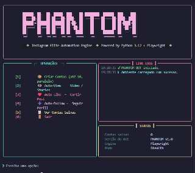

<div align="center">

<!-- ANIMATED PHANTOM HEADER SVG -->


<br/>

<!-- BADGES -->


</div>

---

<div align="center">

```
██████╗ ██╗  ██╗ █████╗ ███╗   ██╗████████╗ ██████╗ ███╗   ███╗
██╔══██╗██║  ██║██╔══██╗████╗  ██║╚══██╔══╝██╔═══██╗████╗ ████║
██████╔╝███████║███████║██╔██╗ ██║   ██║   ██║   ██║██╔████╔██║
██╔═══╝ ██╔══██║██╔══██║██║╚██╗██║   ██║   ██║   ██║██║╚██╔╝██║
██║     ██║  ██║██║  ██║██║ ╚████║   ██║   ╚██████╔╝██║ ╚═╝ ██║
╚═╝     ╚═╝  ╚═╝╚═╝  ╚═╝╚═╝  ╚═══╝   ╚═╝    ╚═════╝ ╚═╝     ╚═╝
         ◈  Instagram Elite Automation Engine v1.0  ◈
```

</div>

---

## ⚡ O que é o PHANTOM?

**PHANTOM** é um bot de engajamento para Instagram construído com uma interface de terminal de nível **profissional**. Roda direto no CMD do Windows com uma UI rica, animada e cheia de painéis — sem interface gráfica, sem frescura.

> Tudo que você precisa para escalar seu engajamento, com apenas **2 cliques**.
---

---

## 🗂️ Estrutura do Projeto

```
📦 PHANTOM BOT
 ┣ 📜 main.py              → Ponto de entrada + loop de menu
 ┣ 📜 setup.bat            → Instalação completa (1 clique)
 ┣ 📜 run.bat              → Executa o bot
 ┣ 📜 requirements.txt
 ┣ 📂 core/
 ┃  ┣ 🎨 interface.py      → UI: ASCII animado, logs, seletor de contas
 ┃  ┗ ⚙️  engine.py         → Playwright Stealth + Human Behavior
 ┣ 📂 modules/
 ┃  ┣ 👤 creator.py        → Criação paralela de contas
 ┃  ┣ ❤️  engagement.py    → Auto-View / Like / Follow
 ┃  ┗ 💾 data_manager.py   → Persistência JSON com Pydantic
 ┗ 📂 data/
    ┗ 🗄️  accounts.json    → Banco de dados local (auto-gerado)
```

---

## ✨ Funcionalidades

<div align="center">

| Módulo | Descrição | Status |
|:---:|:---|:---:|
| 🎨 **UI Premium** | Interface Rich com ASCII animado + painéis + logs ao vivo | ✅ |
| 📦 **Criar Contas** | Até 10 contas criadas **simultaneamente** via sub-endereçamento | ✅ |
| 👁️ **Auto-View** | Visualiza vídeos/stories/reels com múltiplas contas em paralelo | ✅ |
| ❤️ **Auto-Like** | Curte posts com contas selecionadas ao mesmo tempo | ✅ |
| ➕ **Auto-Follow** | Segue perfis com todas as contas selecionadas | ✅ |
| ☑️ **Seletor** | UI de checkbox para selecionar contas (Select All / Deselect) | ✅ |
| 🧠 **Human Behavior** | Mouse Bézier, delays randômicos, digitação variável | ✅ |
| 🛡️ **Stealth Mode** | Playwright configurado para não ser detectado como bot | ✅ |
| 💾 **Persistência** | Contas salvas automaticamente em `accounts.json` | ✅ |

</div>

---

## 🚀 Instalação e Uso

**1. Clone ou baixe o projeto**

```bash
git clone https://github.com/Guifp177/phantom-bot.git
cd phantom-bot
```

**2. Execute o setup (1 único clique)**

```
setup.bat
```

> Cria o ambiente virtual, instala dependências e baixa o Chromium automaticamente.

**3. Inicie o PHANTOM**

```
run.bat
```

---

## 🔧 Stack Técnica

```python
Python     3.12   # Core
Playwright 1.44   # Automação Web
Rich       13.7   # Interface de Terminal
Faker      25.2   # Geração de Dados Realistas
Pydantic   2.7    # Validação de Dados
asyncio    ───    # Execução Paralela
```

---

## 🛡️ Segurança & Anti-Ban

- **Curvas de Bézier** no movimento do mouse
- **Delays randômicos** entre cada ação (800ms–7s)
- **Digitação variável** caractere por caractere (60–220ms/char)
- **Mobile emulation** — simula iPhone/Android
- **Fingerprint único** por contexto de navegador
- **User-agents rotativos** de dispositivos reais

---

<div align="center">

## 👨‍💻 Criadores

<table>
  <tr>
    <td align="center">
      <a href="https://github.com/Guifp177">
        <br/>
        <b>Guifp177</b><br/>
        <sub>Arquitetura & Visão</sub>
      </a>
    </td>
    <td align="center" width="60px">
      <br/><br/>
      <b>✕</b>
    </td>
    <td align="center">
      <br/><br/>
      <b>Claude Sonnet 4.6</b><br/>
      <sub>Engenharia & Código</sub>
    </td>
  </tr>
</table>

</div>

---

<div align="center">

> [!NOTE]
> **Este projeto foi inteiramente 〔 vibe-coded 〕🎧**
>
> *Quase Nenhuma linha foi escrita por mim desta vez — apenas Claude Sonnet 4.6.*
>
> [](https://github.com/Guifp177)

<br/>

```
░░░░░░░░░░░░░░░░░░░░░░░░░░░░░░░░░░░░░░░░░░░░░░░░░░░░░░░░
░  PHANTOM BOT — Made with time, debugginggg & Claude  ░
░░░░░░░░░░░░░░░░░░░░░░░░░░░░░░░░░░░░░░░░░░░░░░░░░░░░░░░░
```

</div>
